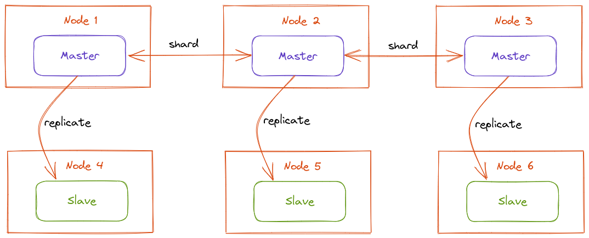

# Setting up a Redis Cluster with TLS

Create a redis cluster using TLS for client and inter-nodes communications.



This repo uses a self-signed CA certificate (`tls/ca.crt`) to create signed client certificates. You can create your own self-signed CA certificate using the following commands.

```bash
openssl genrsa 4096 > ca.key
```

```bash
openssl req -new -x509 -nodes -sha256 -key ca.key -days 3650 -subj "/C=TR/CN=example" -out ca.crt
``` 

# Usage

1. Download the project `git clone git@github.com:ozcankasal/middleware-tutorials-redis-cluster-tls.git`
2. `cd midlleware-tutorials-redis-cluster-tls` 
3. `docker-compose up -d`
